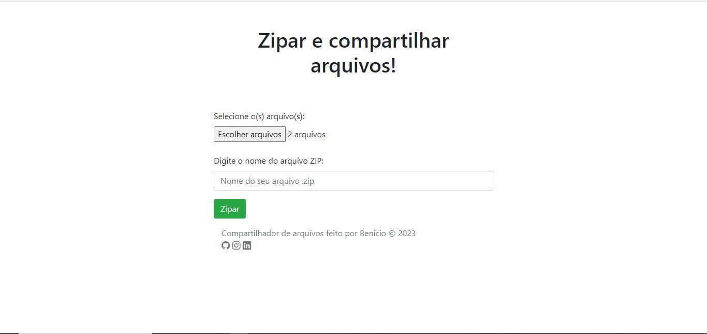
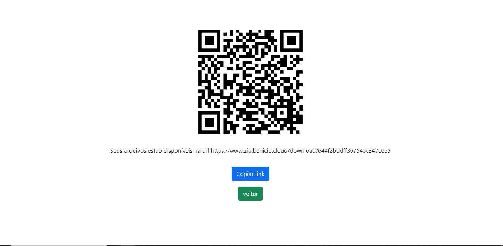

# Compartilhar arquivos zipados!
Acesse <a href="https://www.zip.benicio.cloud">zip.benicio.cloud</a>, escolha quantos arquivos quiser e transforme em um link compartilhável com qrCode!

# 1 - Primeiro acesse <a href="https://www.zip.benicio.cloud">zip.benicio.cloud</a>
Depois que você selecionar os arquivos e escolher o nome do arquivo .zip, aperte em "zipar"!

# 2 - Pronto!
agora você tem um link e um qrCode contendo todos os arquivos que você selecionou!
